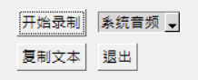

# voice2text

## 安装方法

- clone该项目
- 申请讯飞语音听写的api，并创建 `xunfeikey.py` 文件，添加 `APPID`、`APIKey` 和 `APISecret`三个变量
- 或者在百度大脑申请[语音识别api](https://ai.baidu.com/tech/speech)，并创建 `baiduKey.py` 文件，添加百度大脑的 `apiKey` 和 `secretKey` 两个变量。但讯飞的效果好很多
- `pip install -r requirements.txt`

## 功能

- 可以拖动窗口
- 点击 `开始录制` ，便开始录制音频
- 点击 `停止录制` ，结束录制，并将音频文件复制到剪切板
- 可以切换音频来源是 `系统音频` 还是 `麦克风`
- 点击 `复制文本`，即可将识别到的文本内容复制到剪切板（注意音频长度要小于1分钟）
- 点击 `退出` ，即可退出程序