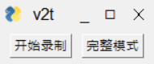
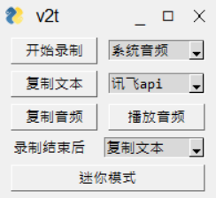

# voice2text

## 安装方法

- clone该项目
- 申请讯飞语音听写的api，并创建 `xunfeiapi/xunfeikey.py` 文件，添加 `APPID`、`APIKey` 和 `APISecret`三个变量
- 或者在百度大脑申请[语音识别api](https://ai.baidu.com/tech/speech)，并创建 `baiduapi/baiduKey.py` 文件，添加 `apiKey` 和 `secretKey` 两个变量。但讯飞的效果好很多
- `pip install -r requirements.txt`

## 功能

- 可以拖动窗口
- 点击 `开始录制` ，便开始录制音频
- 点击 `停止录制` ，结束录制，并将音频文件复制到剪切板
- 可以切换音频来源是 `系统音频` 还是 `麦克风`
- 点击 `复制文本`，即可将识别到的文本内容复制到剪切板（注意音频长度要小于1分钟）
- 可以切换语音识别来源是 `百度api` 还是 `讯飞api`
- 点击 `复制音频`，将音频文件复制到剪切板
- 点击 `播放音频`，即开始播放之前录制的音频
- 可以选择录制结束后自动执行的操作，例如复制文本和复制音频
- 可以切换 `迷你模式` 和 `完整模式` 
- 可以修改配置文件 `config.py`， 实现个性化配置，例如修改默认音频来源和默认语音识别api

## 截图

- 迷你模式

- 完整模式

